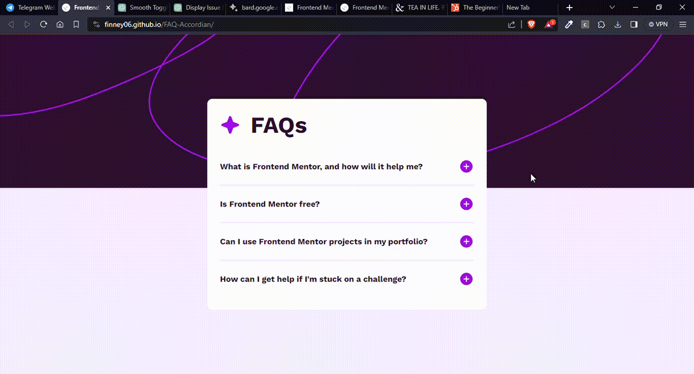

# Overview

This project is a solution to the [FAQ accordion challenge on Frontend Mentor](https://www.frontendmentor.io/challenges/faq-accordion-wyfFdeBwBz). The goal of the project is to create an FAQ accordion that allows users to hide/show answers to questions when the question is clicked. The solution is built using HTML, CSS, and JavaScript.

## Demo

[Link to Live Demo](https://finney06.github.io/FAQ-Accordian/)

### The Challenge

Users should be able to:

- Hide/Show the answer to a question when the question is clicked
- Navigate the questions and hide/show answers using keyboard navigation alone
- View the optimal layout for the interface depending on their device's screen size
- See hover and focus states for all interactive elements on the page

### Project Demo GIF



*The demo GIF showcases the functionality of the FAQ accordion.*

### Links

- Solution URL: [GitHub Repository](https://github.com/Finney06/FAQ-Accordian)
- Live Site URL: [Live Demo](https://finney06.github.io/FAQ-Accordian/)

## My Process

### Built With

- Semantic HTML5 markup
- CSS custom properties
- Flexbox
- JavaScript

### What I Learned

While working on this project, I gained a deeper understanding of JavaScript and its interaction with the DOM. Specifically, I learned that when working with multiple elements selected by a class, I need to iterate through them to add event listeners individually. This knowledge was crucial for handling the toggle functionality for each FAQ item.

I also explored and implemented the `scrollHeight` property in JavaScript. This property represents the entire height of an element's content, including any content that is not currently visible due to overflow. It was useful in creating a smooth and dynamic expansion effect for the FAQ answers.

Here's an example of iterating through elements and adding an event listener:

```javascript
var toggleButtons = document.getElementsByClassName('toggleButton');

for (var i = 0; i < toggleButtons.length; i++) {
  toggleButtons[i].addEventListener('click', function() {
    // Toggle functionality for each button
    // ...
  });
}
```

### Continued Development

As I continue to pursue mastery in JavaScript, I plan to take on more challenges on platforms like Frontend Mentor. This will help me further refine my understanding and application of JavaScript in real world web design.

### Useful Resources

- [ChatGPT](https://chat.openai.com/share/2432fa10-7070-4cb1-a458-d29680294067) - ChatGPT provided valuable insights and assistance, helping me understand JavaScript concepts and providing guidance on implementation.

## Author

- Website - [Finney](https://github.com/Finney06)
- Frontend Mentor - [@Finney06](https://www.frontendmentor.io/profile/Finney06)
- Twitter - [@Osa_finney](https://twitter.com/Osa_finney)

## Acknowledgments

I would like to acknowledge the guidance and support received from ChatGPT during the development of this project. Additionally, I appreciate the Frontend Mentor community for providing challenges that contribute to skill improvement.
